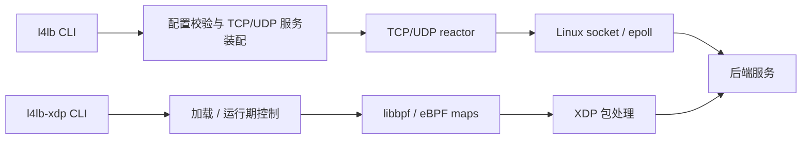

# 系统架构

本文说明当前实现的模块协作、状态所有权和关键约束。版本、发布与验收状态见 [README](README.md)；演进过程见[历史架构记录](docs/history/architecture-history.md)。

## 1. 项目定位与运行边界

本项目是 C++20/Linux 四层负载均衡实验项目，提供两个独立程序：

| 程序 | 数据路径 | 当前能力 |
| --- | --- | --- |
| `l4lb` | Linux socket、non-blocking I/O、LT epoll | TCP 双向字节流代理、UDP flow 转发、轮询、可选健康检查和 stderr 指标 |
| `l4lb-xdp` | libbpf 加载的 XDP/eBPF 程序 | PASS、统计、静态 IPv4/UDP 二层 DSR、运行期配置发布与 UDP 探活 |

用户态代理可以独立构建和运行；XDP 对象与加载器均为可选构建。BPF-only 构建不需要用户态 libbpf 开发依赖，生产构建关闭测试后不依赖 Python。

两个程序不会自动接管彼此的流量。XDP_PASS 表示交回内核网络栈，不保证进入 `l4lb`；XDP 不实现 TCP 代理、NAT 或透明用户态 fallback。

用户态 reactor 和健康/指标维护在同一线程执行；XDP 包处理由内核执行，控制面发布状态时必须考虑并发读者。当前功能验证环境为 Linux/WSL2 隔离网络与 veth，不代表物理 NIC、offload 或多核容量认证。

## 2. 运行拓扑与模块职责

图中 XDP 到后端的转发仅适用于 DSR profile；后端直接向客户端回包。PASS/统计 profile 不执行 DSR 转发。

| 模块与主要源码 | 实际职责与边界 |
| --- | --- |
| [cli/main.cpp](src/cli/main.cpp) | 用户态参数解析、配置检查、启动与顶层错误呈现；不处理转发 |
| [config/Config](src/config/Config.h) | 定义 Config/Endpoint；有界文件读取与纯解析校验分开；不创建网络资源 |
| [core/BackendScheduler](src/core/BackendScheduler.h)、[RoundRobinScheduler](src/core/RoundRobinScheduler.h)、[UdpFlow](src/core/UdpFlow.h) | 纯后端索引选择、UDP key/hash 和空闲时限；不持有连接或 flow 表 |
| [net/TcpReactor](src/net/TcpReactor.h)、[UdpReactor](src/net/UdpReactor.h) | socket/epoll、TCP session 与缓冲、UDP flow 与后端 socket、停止和资源清理 |
| [control/Service](src/control/Service.cpp)、[TcpService](src/control/TcpService.cpp)、[UdpService](src/control/UdpService.cpp) | 协议分派、调度/健康/指标装配和具名事件响应；不复制 reactor 的连接表 |
| [control/HealthSelection](src/control/HealthSelection.h)、[MetricsService](src/control/MetricsService.h) | 健康资格与轮询组合、事件采集和生命周期快照；不搬运业务数据 |
| [health/TcpHealthChecker](src/health/TcpHealthChecker.h)、[UdpProbeChecker](src/health/UdpProbeChecker.h) | 分别执行用户态 TCP 握手探活和 XDP runtime UDP nonce 探测；不选择业务后端或修改 map |
| [metrics/Metrics](src/metrics/Metrics.h) | 收集 `net::StatEvent`、健康快照和 schema=1 stderr 输出；不控制连接，无网络指标 endpoint |
| [xdp/main.cpp](src/xdp/main.cpp)、[XdpAttachment](src/xdp/XdpAttachment.h)、[MapStore](src/xdp/MapStore.h)、[DsrMapStore](src/xdp/DsrMapStore.h)、[RuntimeMapStore](src/xdp/RuntimeMapStore.h) | 独立 XDP 入口、对象与挂载所有权、ABI 校验、map 访问与发布 |
| [control/XdpConfigSync](src/control/XdpConfigSync.h)、[DsrConfigSync](src/control/DsrConfigSync.h)、[RuntimeDsrConfig](src/control/RuntimeDsrConfig.h)、[RuntimeDsrService](src/control/RuntimeDsrService.cpp) | 静态配置同步，运行期有界读取、候选准备、健康联动、重载和停止 |

四类 BPF 程序和共享 C ABI 位于 `src/xdp/`。测试、fixture 与 benchmark 工具位于 `tests/`，不进入生产运行依赖。

内部实现先读同 `.cpp` 匿名命名空间中的类声明、接口组和状态，再读按原顺序排列的类外方法。网络入口见 [TcpReactor.cpp](src/net/TcpReactor.cpp)、[UdpReactor.cpp](src/net/UdpReactor.cpp)，装配入口见上表两个 Service；XDP runtime 的输出和 UDP socket transport 也采用这一组织方式。短转发、简单访问器与原完整重载事务仍按其职责保留。此整理改变源码阅读组织，不新增线程、公共接口或运行功能。

## 3. 关键数据流与控制流

### 3.1 用户态启动与装配

1. `cli` 处理 help/check-config/run；help 不读配置，其他路径由 `Config` 有界加载并完整校验。
2. check-config 输出结果后退出，不创建网络、健康或指标资源。
3. run 调用 `runConfiguredService`，按协议进入 `runTcpService` 或 `runUdpService`。
4. 服务装配 `HealthSelection`、`MetricsService` 和 reactor 回调；开关关闭时不启用相应 probe、统计或周期维护。
5. 完成回调保存后调用 `runTcpReactor` / `runUdpReactor`；reactor 创建网络资源并开始事件循环。
6. ready 响应先输出监听地址，再产生可选 metrics.ready；ready 不代表探活已完成。

健康检查启用时初态 Unknown，新业务只选择 Healthy 后端。维护先推进健康检查，再处理指标；长批次中的新选择也会推进探活，避免使用过期资格。

### 3.2 TCP 与 UDP 业务

**TCP：**客户端连接 → 接受 socket → 选择一次后端 → 建立后端连接 → 双向缓冲转发 → 关闭与统计。

- 轮询和健康资格由 control 提供；无可选后端时拒绝新连接。
- 后端连接失败不换另一个后端重试；已建立 session 不因健康变化而迁移。
- reactor 处理 partial I/O、背压和半关闭，持有 session、两端 socket 和 pending buffer。

**UDP：**datagram → 校验完整数据与目的地址信息 → 查询 flow → 新 flow 选择后端 → 转发整包 → 返回客户端。

- key 包含客户端 IPv4/端口和实际目的 IPv4；监听端口由实例隐含。
- reactor 持有 flow 表和每个 flow 的 connected 后端 socket；已有 flow 保留原绑定。
- 回复通过 listener 的 IP_PKTINFO 保持实际目的 IP 为源地址。
- 成功发送更新空闲时限；flow 按超时与容量规则管理，没有用户态待发队列或可靠重传。

具名 helper 保留原错误域和资源 owner：TCP `dispatchTcpReadyEvents` 在每个就绪事件前检查停止，`connectSessionBackend` 仍由原 `SessionFailure` catch 处理；UDP `registerFlowIndexesAndSocket` 包住双索引和 epoll 注册及原回滚，`resolveFlowTokenForDatagram` 保留过期清理、创建 flow 与异常传播。它们都借用 reactor 已拥有的状态，不新增连接或 flow owner。

用户态 `health_check=tcp_connect` 对 TCP/UDP 均进行 TCP 握手探测；用于 UDP 时只是操作员提供的代理信号，不等于 UDP 应用健康证明。

### 3.3 XDP 静态路径

| profile | BPF 对象 | 配置与包处理 |
| --- | --- | --- |
| `pass` | `xdp_pass.bpf.o` | 返回 XDP_PASS |
| `maps` | `xdp_maps.bpf.o` | schema v1 后端/配置/统计 maps；记录统计，仍返回 XDP_PASS |
| `udp-dsr` | `xdp_udp_dsr.bpf.o` | schema v2；受限 Ethernet/IPv4/UDP 解析、五元组选择、改写二层 MAC 并重定向 |
| `udp-runtime` | `xdp_udp_runtime.bpf.o` | schema v3；从单个活动入口读取不可变快照，执行运行期 DSR |

普通加载顺序：CLI 检查参数与对象 → `XdpAttachment`/store 校验 ELF 和 map ABI → 控制面写入、回读并冻结配置 → attach → 等待停止 → 条件 detach 和统计。

静态 maps/DSR 配置不原地更新，修改需停止重启。DSR 只支持一个 VIP 和最多 64 个 IPv4 后端，后端 VIP、回程和邻居由部署方配置，产品不代管网络。

静态 DSR 的非目标、未支持或坏配置等情况按既定规则 PASS，重定向 helper 即时失败 DROP；请求重定向不保证最终送达。运行期 profile 对有效匹配但没有活动后端的报文 DROP。具体解析和计数规则见规格页。

### 3.4 XDP 运行期发布与重载

1. `RuntimeDsrConfig` 读取配置，`UdpProbeChecker` 准备探测资源；初始 Unknown 集合生成空活动快照，发布后再 attach。
2. `RuntimeDsrService` 在单线程循环中优先消费停止信号，再处理 probe、重载和发布。
3. 探测状态变化形成 desired 集合；只有实际发布成功才改变 applied generation，两者可能暂时不同。
4. SIGHUP 先解析候选配置并准备候选 probe/state，再创建、写入、回读、冻结完整 inner map。
5. `RuntimeMapStore` 用一次 outer map 更新提交新快照；每个包只取得一次 inner 引用，避免混读新旧配置。
6. 提交前失败保留原活动快照；提交后致命观测或输出失败终止并清理，不能声称已经回滚。

generation 不回绕，健康集合的发布失败可在后续循环按既定节奏重试；重载被拒时保留旧配置，由后续 SIGHUP 再提出候选。旧 inner 由内核引用/RCU 退休，map ID 消失不等于同步物理回收。后端集合变化可能重映射已有 UDP 流，没有连接 draining 或无损迁移承诺。

runtime 使用 UDP nonce echo 探测，校验身份和截止；它与用户态 TCP 握手探测是不同契约。runtime 输出使用有界非阻塞队列，避免无限缓存；细节见[运行期控制规格](docs/specs/xdp-runtime-control.md)。

[RuntimeDsrService](src/control/RuntimeDsrService.cpp) 的 `publishChangedHealthySnapshot` 只负责原健康差异发布；提交前遇到停止时返回 false，由外层循环退出。重载仍保留完整候选事务及原 catch；健康发布失败保留 applied，提交后或永久输出错误仍致命。`waitForRuntimeSignalsOrOutput` 仅保留原等待段，输出 flush 仍在调用之前。

[UdpProbeChecker.cpp](src/health/UdpProbeChecker.cpp) 的 `sendDueProbePackets` 先处理到期，再发送；`receivePendingProbeReplies` 按原轮转预算处理回复，保持完成时钟与截止优先。两个调用仍在 `pollProbeTransitions` 的同一个总 catch 中，异常取消所有 probe 后传播；nonce 与 probe 资源均由原 checker 持有。

## 4. 状态所有权、回调与资源生命周期

### 4.1 状态由谁持有

| owner | 持有或借用的状态 |
| --- | --- |
| Config / RuntimeDsrConfiguration | 启动或候选配置值；格式与读取路径分别负责 |
| TcpServiceRuntime / UdpServiceRuntime | 借用 Config，拥有 HealthSelection 和 MetricsService |
| HealthSelection | 拥有轮询 scheduler 和可选 TcpHealthChecker；不持有业务 session/flow |
| TcpReactor / UdpReactor | 拥有 listener、epoll、业务 socket、索引、缓冲/flow 和停止状态 |
| TcpHealthChecker / UdpProbeChecker | 拥有各自 probe socket、token、deadline 和健康状态 |
| MetricsService | 拥有 collector/output，借用 selection owner 槽以读取健康快照 |
| XdpAttachment / RuntimeMapStore | attachment 拥有 libbpf object 与挂载；runtime store 借用 object/map FD，拥有当前 active inner FD |
| RuntimeDsrService | 管理 configuration、checker、applied generation、信号与有界输出队列 |

连接、flow、健康和指标主要是内存状态，不持久化；XDP maps 是内核共享状态。项目没有统一持久 BackendPool、数据库或独立公共日志框架。

### 4.2 同步回调与借用边界

- `setXxxCallback` 只保存回调；服务完成装配后才进入 reactor。
- 短 lambda 转发到具名响应函数。reactor 借用回调容器，只在当前 run 的调用线程使用，返回后不保存；没有跨线程投递。
- BackendSelector、BackendHealthProvider 和 syscall 注入属于同步策略/替代接口，不应当作持久事件队列理解。
- MetricsService 借用 selection 的 owner 槽；该槽先于 metrics 构造，selection 在服务生命周期 try 中创建。服务完成回调装配后才运行 reactor，成员顺序使 metrics 先析构，selection 随后析构。
- store 的借用 FD 只能在 libbpf object 存活时使用。XdpAttachment 析构函数体关闭 object 后，runtimeMaps_ 随后析构仅关闭自有 activeFd，不再访问借用 FD。

### 4.3 停止与错误传播

- TCP 首次停止后冻结新接收和维护，在原截止内尝试发送已有 pending；不保证在途数据送达。UDP 停止直接关闭 flows。
- reactor 清理资源后，control 输出停止说明与 metrics.final；异常时各清理步骤尽力执行，保留首异常并传播到 CLI。
- 用户态 metrics 同步输出 stderr，可能阻塞；reactor 的 drain 预算不等于整个进程退出的墙钟上限。
- XDP 条件卸载比较程序身份，不卸载 foreign program；runtime 停止先 detach、取消 probe、读取统计，再有界排空输出。
- SIGKILL 不能执行产品清理，残留挂载需按实际 program ID 显式恢复。
- 单 session/flow 的业务错误与服务级致命错误分别处理；资源、checker、发布和输出故障不能一概当作普通后端不健康。

## 5. 依赖关系与关键约束

### 5.1 实际依赖边界

- 用户态入口链接 `l4lb_config` 和 `l4lb_control`；control 装配 net、core、health、metrics。独立 XDP 加载器不链接进原 `l4lb`。
- core/net/health/metrics 复用 `config/Config.h` 的值类型；core 不读取配置文件、不执行网络 I/O。
- health 使用轻量 FD/socket 能力，但不修改 reactor 连接表；metrics 接收 `net/Statistics.h` 定义的事实事件，通过 provider 读取健康快照。
- XDP 同步与加载适配层通过 map 接口和配置类型协作；当前包括 `XdpAttachment.h → control/DsrConfigSync.h` 的引用，目录职责分层不是严格的单向 include 图。
- RuntimeDsrConfig 与 RuntimeDsrService 是独立 runtime 产品边界，前者读取文件，后者使用 signalfd/poll 编排；不能泛称 control 完全不执行系统调用。
- BPF 程序只依赖允许的内核/UAPI 与共享 C schema，不依赖 C++ 对象或用户态运行时。

### 5.2 修改必须保持的约束

1. 配置解析、服务装配与转发 I/O 分离；数据面不读取配置文件，调度算法不持有 socket。
2. 用户态配置完整校验后才运行；当前字段与默认值以[配置规格](docs/specs/config-schema.md)和 Config 为准，不承诺未实现的权重或可配置超时。
3. 用户态服务保持单线程所有权；增加线程或跨进程共享状态时必须重新设计执行与同步边界。
4. XDP 四 profile、共享 schema v1/v2/v3、字节序和 map/program/object 契约明确区分；C/BPF 与 C++ 通过固定宽度布局及 static_assert 校验 ABI。
5. 静态配置先完整同步并冻结再 attach；runtime 不可变快照以 outer 更新为提交点，不能原地篡改已发布快照。
6. 健康状态不等于业务连接迁移；ready 不等于 Healthy，UDP echo/TCP 握手也不等于完整应用健康。
7. 网络资源与挂载必须有明确 owner 和清理路径；特权验证只操作明确的自有资源，不把部署网络配置混入产品。

## 6. 详细规格、运行与验证入口

架构正文保留协作和所有权；精确字段、协议边界、操作命令和验证证据由以下文档维护。

| 内容 | 权威入口 |
| --- | --- |
| 构建、快速运行、当前测试与状态 | [README](README.md) |
| 用户态配置、调度 | [配置](docs/specs/config-schema.md)、[调度](docs/specs/scheduler.md)；旧内部标识符的当前映射见上文源码索引 |
| TCP、UDP、健康与指标语义 | [TCP](docs/specs/tcp-forwarding-semantics.md)、[UDP flow](docs/specs/udp-flow-table.md)、[健康](docs/specs/health-check.md)、[指标](docs/specs/metrics.md) |
| 稳定用户可见行为 | [用户态契约](docs/specs/v1.0-user-visible-contract.md) |
| XDP ABI、DSR 与运行期控制 | [map schema](docs/specs/xdp-map-schema.md)、[UDP DSR](docs/specs/xdp-udp-dsr.md)、[runtime](docs/specs/xdp-runtime-control.md) |
| XDP 环境、加载与实际验证 | [环境](docs/runbooks/linux-xdp-env.md)、[加载器](docs/runbooks/xdp-loader.md)、[验证](docs/runbooks/xdp-validation.md) |
| 性能方法与适用边界 | [用户态方法](docs/benchmarks/methodology.md)、[V1.2 方法](docs/benchmarks/v1.2-methodology.md) |
| 版本演进与架构历史 | [ROADMAP](ROADMAP.md)、[历史架构](docs/history/architecture-history.md) |

验证覆盖配置/调度等单元规则、TCP/UDP 真实产品、健康/指标/异常停止，以及显式执行的 XDP 内核场景。普通产品测试与必要特权环境准备分开；历史版本验收和性能数据只证明当时记录的产品与环境，不作为当前平台或性能上限保证。
